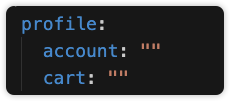
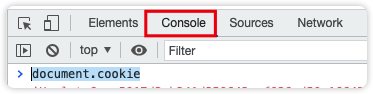
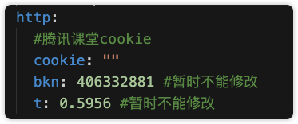

# 腾讯课堂下载

## 使用方法
### 获取cart
> 填写cart 到本下载器的 config.yaml 的profile.account 和 profiel.cart 配置中



### 获取cookie
> 先在你的浏览器打开腾讯课堂完成登录, 然后按 f12 打开控制台, 选择 console 的选项, 输入下面英文, 就可以获取到登录信息了
```
document.cookie
```


> 然后把登录信息填写到本下载器的 config.yaml 的 http.cookie 选项中, 如图所示



### 运行下载器
> 输入以下命令, 就可以完成下载
```
./tl --cid 4033472
```
> 4033472 是课程id, 如图所示获取


## 今天cart
```
account: 123456
cart: 012ca5568c8f0f3226d4425f1a65cea9f0253747ef2f50cd25d2590a815ac35a
```